# 
 GuardiApp

## **Índice de contenido**
- [**Índice de contenido**](#índice-de-contenido)
- [**Introducción**](#introducción)
- [**Servicio Web**](#servicio-web)
- [**Aplicación móvil**](#aplicación-móvil)
  - [*Descripción*](#descripción)
  - [*Funcionalidades*](#funcionalidades)
    - [Login del profesor](#login-del-profesor)
    - [Pantalla de inicio](#pantalla-de-inicio)
    - [Generar aviso de guardia](#generar-aviso-de-guardia)
    - [Ver avisos de guardia](#ver-avisos-de-guardia)
    - [Realizar guardia](#realizar-guardia)
- [**Aplicación de escritorio**](#aplicación-de-escritorio)
  - [*Descripción*](#descripcic3b3n-1)
  - [*Funcionalidades*](#funcionalidades-1)
    - [Login del profesor](#login-del-profesor-1)
    - [Listado de guardias](#listado-de-guardias)
    - [Propiedad de guardia](#propiedad-de-guardia)
- [**Autores del proyecto**](#autores-del-proyecto)

## **Introducción** :bowtie:

Proyecto intermodular del 2º curso de Desarrollo de Aplicaciones Multiplatadormas. GuardiApp se encarga de la gestión de las guardias del profesorado del centro IES Miguel Herrero.

El resultado de este proyecto son dos aplicaciones, una móvil y otra de escritorio, que, a través de una API que se conecte a la base de datos pertinente, consiguen gestionar las guardias de los profesores que imparten clase en el centro antes mencionado.

---

## **Servicio Web** :floppy_disk:

A través de Spring Tool Suite se realiza la conexión a la base de datos *proyectofaltas* que está en MySQL.

Por un lado, en el paquete es.intermodular.rest.modelo se guardan las distintas clases necesarias para unir API y base de datos.

Por otro lado, en el paquete es.intermodular.rest.controlador estarán ubicados los distintos controladores para hacer las peticiones que necesitarán las diversas funcionalidades de las aplicaciones para realizar consultas en la base de datos.

---
## **Aplicación móvil** :iphone:
### *Descripción*
La aplicación móvil está diseñada para Android y está programada en Kotlin con IntelliJ Idea.

### *Funcionalidades*
#### Login del profesor

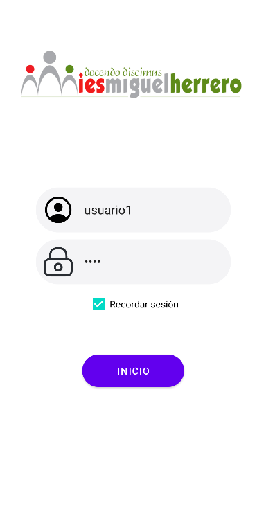

El **login** es la primera pantalla que verá el usuario al acceder a la aplicación. El logo del instituto va a encabezar esta pantalla donde el profesor tendrá que indicar su nombre de usuario así como su contraseña. Por defecto, la contraseña estará oculta salvo que el usuario quiera visualizarla, en cuyo caso tendrá que clickar sobre el candado situado al lado de ésta.

Asimismo hay opción de recordar los datos de usuario para no tener que introducirlos cada vez que quiera acceder a la aplicación. Para ello simplemente hay que marcar la casilla Recordar sesión situada debajo de la contraseña.

Al pulsar el botón *`Inicio`*, si los datos son correctos, el profesor logrará acceder a la aplicación. De lo contrario, le saltará un aviso, en forma de toast, que le indicará al usuario que hay un error de inicio de sesión por lo que no podrá pasar a la siguiente pantalla hasta que estos datos sean correctos.

*Ejemplo práctico de login mostrando contraseña:*

*Ejemplo de aviso mediante toast que se muestra al introducir datos erróneos y cuando el servicio esté caído:*

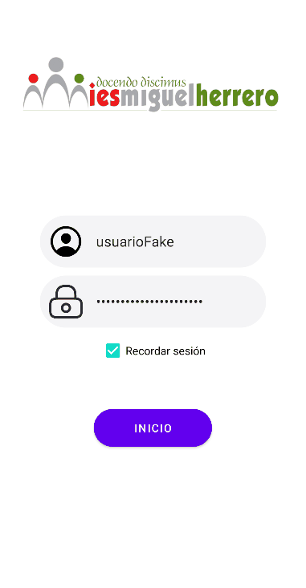 

#### Pantalla de inicio

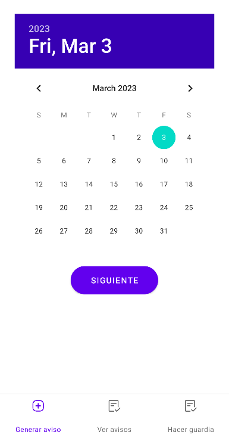

Una vista de calendario va a imperar la pantalla de inicio con información como el día así como el mes actual y, seleccionado por defecto en el calendario el día actual.

En esta pantalla se pueden hacer tres acciones al seleccionar los botones situados en la parte inferior de lapantalla: 
- Generar un aviso
- Ver los avisos que hay
- Realizar una guardia.

#### Generar aviso de guardia

Esta opción sirve para que un profesor genere un aviso de que va a faltar un día, a una o varias horas.

Por defecto, en la pantalla de inicio ya está marcada la opción  **Generar aviso**. A continuación, el usuario deberá seleccionar un día en el calendario que se muestra en la pantalla de inicio y pulsar en el botón *`Siguiente`*, para indicar qué día se va a ausentar.

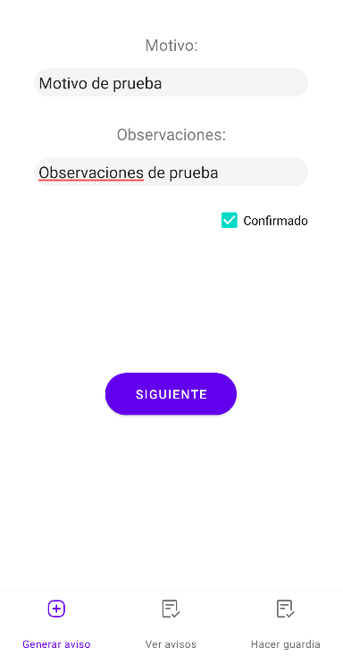

En la pantalla que se muestra deberá indicar el motivo y podrá dejar algunas observaciones. Cuando pulse el botón *`Siguiente`*, pasará a la siguiente pantalla para completar el aviso.

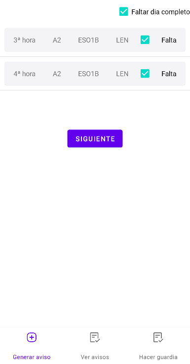

En esta pantalla se le mostrarán todas las horas de clase que tiene en el día indicado, para seleccionar una, varias e incluso hay una opción, ubicada arriba a la derecha, que permite, al marcarla, seleccionar todas las horas de dicho día.

Al pulsar el botón *`Siguiente`* se mostrará la siguiente pantalla con un resumen de toda la información del profesor sobre el aviso que va a realizar:

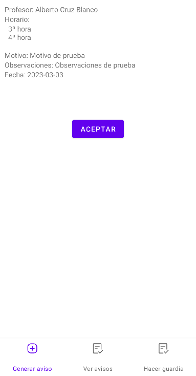

Aquí vemos que está el nombre del profesor, las horas a las que va a faltar, el motivo de su ausencia, las observaciones que indique y por último, la fecha de su ausencia. Cuando se clique en el botón *`Aceptar`* abrirá una ventana para confirmar que se desea guardar dicho aviso. Si se pulsa el botón *`Si`* se guardará la ausencia del profesor en la lista de avisos. En caso de que se pulse el botón *`No`*, salta un toast para indicar que no se ha realizado el aviso de guardia, por lo que no se pasa a la siguiente pantalla.

*Ejemplo práctico de generar aviso de guardia con las distintas opciones que el usuario tiene a su alcance:*

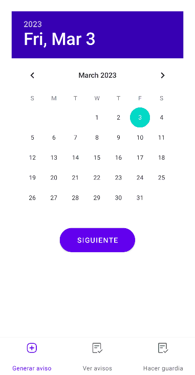

#### Ver avisos de guardia

Con esta opción el usuario podrá visualizar los avisos de guardias que hay generados.

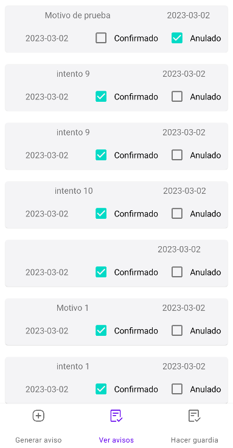

Al ir a la sección **Ver avisos** se ve una lista con los distintos avisos de las faltas de los profesores que coincidan con los horarios de guardia del profesor que ha iniciado sesión. La información que aparece es el motivo de la ausencia y la fecha. Asimismo se puede indicar si una guardia ha sido realizada por el profesor marcando la casilla `Confirmar` o indicar que esa falta ha sido anulada marcando la casilla `Anular`.

*Ejemplo práctico de generar aviso de guardia con las distintas opciones que el usuario tiene a su alcance:*

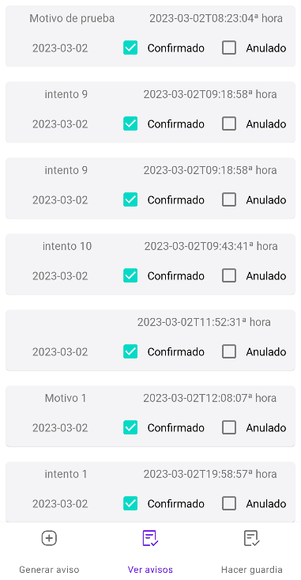

#### Realizar guardia

Esta tercera opción sirve para indicar que el usuario realizará una guardia.

Al ir a la sección **Realizar guardia** le aparecerá al usuario información en el caso de que haya algún aviso de guardia generado, el día en el que se encuentre conectado, y que coincida con los horarios de guardia que el usuario tenga programados.

Como información, se indica el nombre completo del profesor que va a faltar, la hora, así como el aula y el grupo que se verán afectados por dicha falta. Cada falta tendrá, situada a la derecha de la misma, una casilla que se puede marcar para indicar que se quiere realizar dicha guardia. Al marcarla se abrirá una ventana de confirmación para asegurarse de que el usuario no se ha equivocado y realmente puede realizar dicha guardia. Si pulsa en el botón *`Sí`*, esta guardia quedará como realizada por el usuario y saltará un aviso en forma de toast que indicará que la guardia se ha realizado; en el caso de que se pulse el botón *`No`*, la casilla se desmarcará automáticamente y saltará un aviso, también en forma de toast, para indicar que no se ha realizado la guardia.

*Ejemplo práctico para hacer una guardia, con todas las opciones que el usuario tiene a su alcance:*

---
## **Aplicación de escritorio** :computer:
### *Descripción*
La aplicación de escritorio está diseñada para Windows y está programada en C# con Winforms.

Todas las ventanas, en esta aplicación, dispondrán de botones ubicados en la parte superior derecha de cada ventana, que le permitirán al usuario *`minimizar`*, *`maximizar`* y *`cerrar`* dichas ventanas. 

### *Funcionalidades*
#### Login del profesor

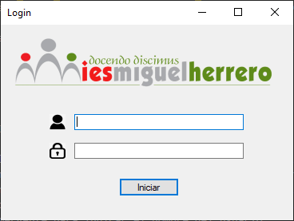

Al igual que ocurre en la aplicación móvil, al iniciar la aplicación de escritorio será la pantalla de **Login** lo primero que el usuario visualice. Aquí, el usuario tendrá que indicar su nombre de usuario y su contraseña donde así lo indiquen iconos correspondientes y al pulsar el botón *`Iniciar`*, si éstos son correctos, tendrá acceso al contenido de la aplicación, pero además saltará una ventana emergente para indicar el nombre del usuario.

*Ejemplo práctico de login de usuario:*

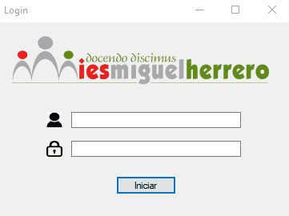

#### Listado de guardias

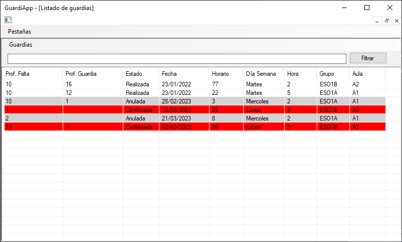

En la pantalla de **Listado de guardias** se podrá ver, al igual que dicha pantalla indica, un listado con los profesores y las distintas guardias que hay. 

Para abrir el listado, la aplicación tendrá un botón, situado arriba a la izquierda, con el nombre *Pestañas* que, al pulsar se abrirá un menú con el nombre *Guardias*.
Se puede elegir filtrar por nombre de profesor, por la fecha del día de la guardia, el grupo y el aula. Al aplicar los filtros se muestra en la lista información con el profesor que falta, el profesor que va a hacer dicha guardia, el estado de la guardia, la fecha, el horario, el día de la semana, la hora, el grupo y el aula.

En esta pantalla, al clickar con el botón derecho del ratón, se abrirá un menú con tres opciones:
- Nueva
- Editar
- Borrar

Si el click se realiza fuera de la lista, sólo estará disponible la opción *`Nueva`*. Al seleccionarla se abrirá una ventana emergente que es una **Propiedad de guardia**, con todos los campos vacíos que, tras rellenarlos, permitirá añadir a la lista una nueva guardia.

En caso de que el click se realice dentro de la lista, se podrá editar la guardia sobre la que se clicka, en caso de que se seleccione la opción *`Editar`*, o eliminar en caso de que se seleccione la opción *`Borrar`*.

Cuando se selecciona la opción *`Editar`*, también se abrirá una ventana emergente **Propiedad de guardia** pero, al contrario que ocurre en nueva, los cambios están completados y a falta de modificar.

#### Propiedad de guardia

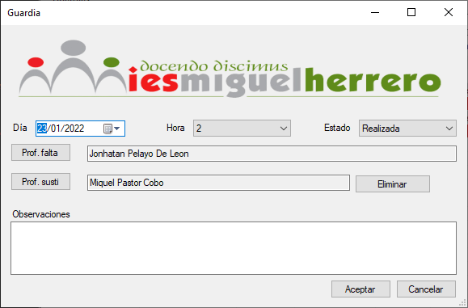

La pantalla **Propiedad de guardia** se abre en una ventana emergente.

Aquí, se van a indicar los distintos elementos necesarios para informar de una guardia. Estos elementos van a coincidir casi en su totalidad con los indicados en **Listado de guardias**, por lo tanto habría que indicar: el día, que tiene opción a abrir el calendario para indicar el día sin necesidad de escribirlo; la hora, el grupo, el aula y el estado, todos ellos siendo menús desplegables; y los profesores, tanto el que falta como el sustituto. Hay un botón de *`Eliminar`* en caso de que se hubiese equivocado al introducir el profesor sustituto. Por último, y en lo que difiere con el **Listado de guardias** es que hay un cuadro para rellenar con información acerca de las observaciones que se quieran indicar.

Para terminar, se dispone de los botones *`Aceptar`* y *`Cancelar`*. El primero sirve para guardar la guardia dentro del listado de guardias y el segundo sirve para cerrar la ventana sin guardar ninguno de los datos. Se puede usar tanto el botón *`Cancelar`* como la X situada arriba a la derecha de la ventana.

*Ejemplo práctico de Listado de guardias, así como creación, edición y borrado de guardias:*

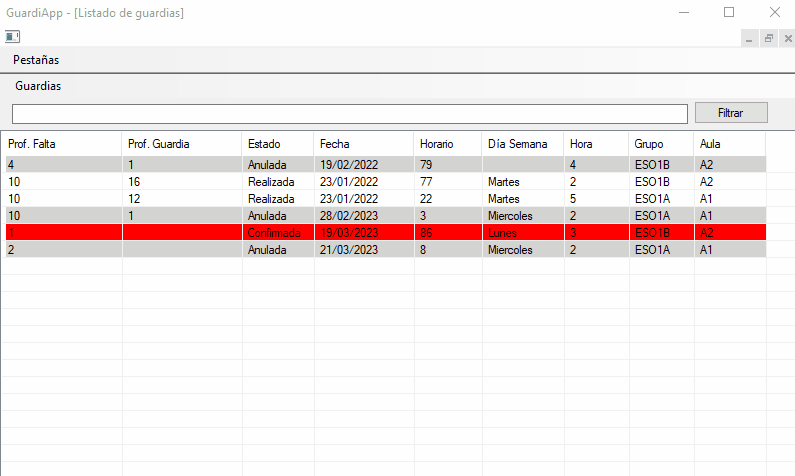

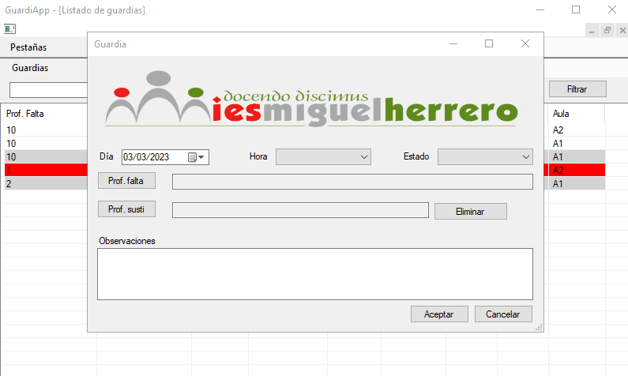

---
## **Autores del proyecto** :godmode:

- **Aarón Quintanal Martín** - *Dirección del proyecto - API - Aplicación móvil - Aplicación de escritorio*
- **Jaime de Cos Gómez** - *Aplicación de escritorio - API*
- **Verónica Álvarez Lavín** - *Aplicación de escritorio*
- **Oana Irina Cutitaru Ciobanu** - *Documentación*

